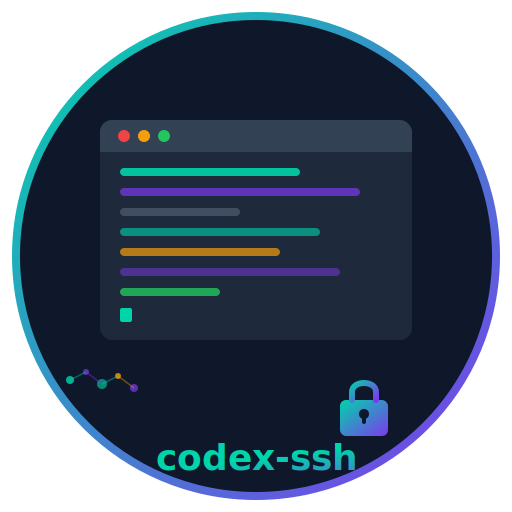

<p align="center">
  
  <h1 align="center">⚙️ Codex SSH</h1>
  <p align="center"><strong>AI 原生的 SSH 管理工具 — 让 AI 助手自动管理你的服务器。</strong></p>
</p>

<p align="center">
  <a href="https://github.com/xlyoung/codex-ssh/actions/workflows/ci.yml"></a>
  <a href="https://goreportcard.com/report/github.com/xlyoung/codex-ssh"></a>
  <a href="LICENSE"></a>
  <a href="https://github.com/xlyoung/codex-ssh/releases"></a>
  <a href="https://golang.org"></a>
</p>

<p align="center">
  <a href="README.md">English</a> · <a href="README_CN.md">中文</a>
</p>

---

## 什么是 Codex SSH？

Codex SSH 是一款 **AI 原生的 SSH 管理工具**，专为 Codex、Claude、Hermes 等 AI 助手设计。它提供了结构化、可审计、安全的接口，连接 AI 代理与远程服务器 — 将自然语言转化为可靠的基础设施运维操作。

传统 SSH 工具服务于人类操作者。Codex SSH 服务于 **AI 代理** — 内置 inventory 系统、跳板机链路编排、Keychain 密码管理、结构化审计日志，以及原生的 **MCP（Model Context Protocol）服务器**，任何 AI 工具都可以直接调用。

> **一个二进制文件。零依赖。AI 优先。**

---

## ✨ 核心特性

- 🤖 **AI 原生设计** — 为 Codex、Claude、Hermes 打造，支持 MCP 服务器
- 🔐 **安全优先** — macOS Keychain 密码管理、Askpass 注入、审计日志脱敏
- 🚀 **单文件 Go 二进制** — 跨平台、零依赖、随处运行
- 🔌 **MCP 协议** — 标准 AI 工具接口（`ssh_exec`、`ssh_diagnose`、`ssh_hosts_list`、`ssh_audit`）
- 🌐 **跳板机穿透** — 自动处理多级 ProxyJump 链路
- ⚡ **并行执行** — 使用 `@tag` 语法在多台服务器上同时执行命令
- 🔍 **服务器诊断** — 一键检测：tmux、nohup、docker、sudo
- 🔧 **Shell 补全** — Bash、Zsh、Fish 自动感知主机和标签
- 📦 **SFTP 文件传输** — 使用 `put`、`get`、`sync` 命令上传、下载和同步文件
- 🔑 **权限提升** — 通过 `exec --sudo`/`--su` 以 sudo 或 su 权限执行命令
- 🔄 **动态主机管理** — 使用 `hosts reload`/`discover` 热重载清单和网络发现
- 📝 **Playbook 引擎** — 用 YAML 定义多步部署工作流（Beta）
- 🏥 **健康检查系统** — 监控所有服务器的 CPU、内存、磁盘和负载
- 🔑 **SSH 密钥管理** — 跨文件、SSH Agent 和 OS Keychain 列出、检查和管理密钥
- 📊 **审计统计** — 使用时间范围查询审计日志、导出 JSON/CSV、日志轮转

---

## 🚀 快速开始

### 安装

**Homebrew**（macOS / Linux）：

```bash
brew install xlyoung/tap/codex-ssh
```

**预编译二进制**（Linux / macOS）：

```bash
curl -fsSL https://raw.githubusercontent.com/xlyoung/codex-ssh/main/install.sh | bash
```

**go install**（需要 Go 1.22+）：

```bash
go install github.com/xlyoung/codex-ssh/cmd/codex-ssh@latest
```

### 配置

```bash
# 导入现有 SSH 配置
codex-ssh hosts import-ssh-config

# 手动添加服务器
codex-ssh hosts set myserver --host 192.168.1.100 --user deploy
```

### 验证

```bash
codex-ssh hosts list           # 列出所有管理的服务器
codex-ssh hosts test myserver  # 测试连接
codex-ssh doctor               # 本地健康检查
```

---

## 💻 使用示例

### 在远程服务器上执行命令

```bash
# 单台服务器
codex-ssh exec myserver -- "uname -a"

# 所有 tag 为 web 的服务器
codex-ssh exec @web -- "systemctl status nginx"

# 所有服务器
codex-ssh exec @all -- "df -h"
```

### 交互式 Shell

```bash
codex-ssh shell myserver --cwd /srv/app
```

### 端口转发与 SOCKS5 代理

```bash
# 将本地 8080 端口转发到远程 127.0.0.1:80
codex-ssh tunnel myserver --local 8080 --target 127.0.0.1:80

# 启动 SOCKS5 代理
codex-ssh proxy myserver --local 1080 --background
```

### 诊断

```bash
codex-ssh diagnose myserver
```

### 审计日志

```bash
codex-ssh audit query --host myserver --format text
```

---

## 🏗️ 架构

```
┌─────────────────────────────────────────────────────┐
│                  AI 代理层                            │
│         Codex · Claude · Hermes · Cursor             │
└──────────────────────────┬──────────────────────────┘
                           │ MCP (stdio)
┌──────────────────────────▼──────────────────────────┐
│                 MCP 服务器层                          │
│    ssh_exec · ssh_hosts_list · ssh_diagnose ·        │
│    ssh_audit                                         │
└──────────────────────────┬──────────────────────────┘
                           │
┌──────────────────────────▼──────────────────────────┐
│                  CLI / 命令层                         │
│   exec · shell · tunnel · proxy · job · audit ·      │
│   diagnose · hosts · secret · completion              │
└──────────────────────────┬──────────────────────────┘
                           │
┌──────────────────────────▼──────────────────────────┐
│                  核心引擎层                           │
│         executor · hosts · secrets · config          │
│         tunnel · proxy · jobs · audit                │
└──────────────────────────┬──────────────────────────┘
                           │
┌──────────────────────────▼──────────────────────────┐
│                  传输层                               │
│       OpenSSH · SSH Agent · Keychain · Askpass       │
└──────────────────────────┬──────────────────────────┘
                           │
┌──────────────────────────▼──────────────────────────┐
│                  目标层                               │
│      直连 · 跳板机 · ProxyJump 链路                   │
└─────────────────────────────────────────────────────┘
```

---

## 🔌 MCP 集成

Codex SSH 内置 **MCP（Model Context Protocol）服务器**，将 SSH 操作暴露为标准 AI 工具。

### 启动 MCP 服务器

```bash
codex-ssh mcp serve
```

### 可用 MCP 工具

| 工具 | 描述 |
|------|------|
| `ssh_hosts_list` | 列出 inventory 中的所有主机 |
| `ssh_exec` | 在远程主机上执行命令（支持超时） |
| `ssh_diagnose` | 诊断连接状态和远程能力 |
| `ssh_audit` | 查询 SSH 操作的审计日志 |

### Claude Desktop 配置

在 Claude Desktop 的 `claude_desktop_config.json` 中添加：

```json
{
  "mcpServers": {
    "codex-ssh": {
      "command": "codex-ssh",
      "args": ["mcp", "serve"]
    }
  }
}
```

### Cursor / Windsurf 配置

在 MCP 设置中添加：

```json
{
  "mcpServers": {
    "codex-ssh": {
      "command": "codex-ssh",
      "args": ["mcp", "serve"]
    }
  }
}
```

连接后，你的 AI 助手可以列出服务器、执行命令、运行诊断、查询审计日志 — 全部通过结构化工具调用完成。

---

## 📖 文档

| 文档 | 说明 |
|------|------|
| [需求文档](docs/REQUIREMENTS.md) | 功能规格与设计细节 |
| [路线图](docs/ROADMAP.md) | 完整功能路线图（P0 → P2） |
| [贡献指南](CONTRIBUTING.md) | 如何参与贡献 |
| [行为准则](CODE_OF_CONDUCT.md) | 社区准则 |

### 项目结构

```
codex-ssh/
├── cmd/codex-ssh/          # 主程序入口
├── internal/               # 内部包
│   ├── cli/               # CLI 命令与 Shell 补全
│   ├── config/            # 配置管理
│   ├── hosts/             # 主机清单
│   ├── secrets/           # Keychain 密码管理
│   ├── sshargs/           # SSH 参数构建
│   ├── sshconfig/         # ~/.ssh/config 解析
│   ├── executor/          # 远程命令执行
│   ├── tunnel/            # 端口转发
│   ├── proxy/             # SOCKS5 代理
│   ├── jobs/              # 后台任务管理
│   ├── audit/             # 结构化审计日志
│   ├── askpass/           # 密码注入
│   ├── mcp/               # MCP 服务器（JSON-RPC）
│   ├── runtime/           # 运行时状态
│   └── validate/          # 输入验证
├── pkg/model/             # 共享数据模型
├── scripts/               # 构建与安装脚本
├── defaults/              # 默认配置模板
└── docs/                  # 文档
```

---

## 🤝 贡献

欢迎贡献！请阅读 [贡献指南](CONTRIBUTING.md) 了解详情。

```bash
# Fork 并克隆
git clone https://github.com/<your-username>/codex-ssh.git
cd codex-ssh

# 构建
go build ./cmd/codex-ssh

# 测试
go test -race ./...

# 代码检查
golangci-lint run
```

我们遵循 [Conventional Commits](https://www.conventionalcommits.org/) 规范：
`feat:`、`fix:`、`docs:`、`test:`、`refactor:`、`perf:`、`ci:`、`chore:`

---

## 📄 许可证

[MIT License](LICENSE) — Copyright (c) zhuohua yang

---

<p align="center">
  <strong>Codex SSH</strong> · 由 <a href="https://github.com/xlyoung">zhuohua yang</a> 用 ❤️ 打造
</p>
